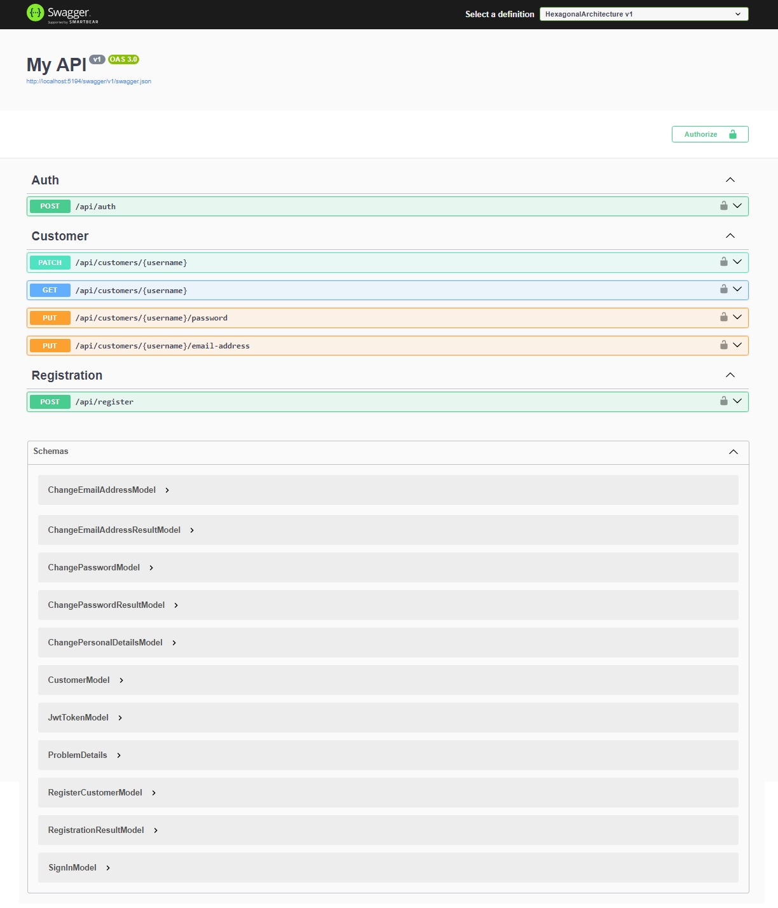

# ASP.NET - Ports-And-Adapters / Hexagonal Architecture with DDD


## Overview
This project, developed as a practice exercise to gain familiarity with C# and ASP.NET, follows **Hexagonal Architecture** (also known as **Ports-and-Adapters Architecture**) alongside **Domain-Driven Design (DDD)** principles. It provides a modular, clean, and testable structure, with a focus on user registration, authentication, and management of user details. Despite its simplicity and lack of specific business goals, the project effectively demonstrates modern architectural and development approaches in ASP.NET.

|Build Status|License|
|------------|-------|
|[]([https://github.com/hirannor/springboot-hexagonal-ddd/actions/workflows/maven.yml](https://github.com/hirannor/hexagonal-architecture-asp-net-core/blob/main/.github/workflows/dotnet.yml))|[](https://opensource.org/licenses/MIT)|

## Prerequisites for development:
- **.NET 8.0 SDK**: The project is built on the .NET 8.0 framework, so having the latest SDK is essential.
- **Visual Studio or VS Code**: Any modern IDE that supports .NET development, such as Visual Studio 2022 or Visual Studio Code with C# extensions, is recommended.
- **Docker**: Required for running containers, especially for integration testing with Testcontainers.
- **SQL Server**: The project relies on SQL Server for persistence, so a local or cloud instance should be available.

## Used technologies (programming languages, frameworks, libraries etc.):
- **.NET 8.0**: The latest version of .NET for performance improvements, security, and modern features.
- **ASP.NET Core**: The framework used for building the Web API and handling HTTP requests.
- **Entity Framework Core (EF Core)**: Provides an ORM for interacting with a SQL Server database, simplifying CRUD operations.
- **MailKit**: A library for sending emails, which is useful in user notification scenarios.
- **XUnit**: The testing framework used for unit testing the application components.
- **Moq**: A mocking library for creating test doubles, allowing for isolated unit tests.
- **TestContainers**: Used for running Docker containers within tests, enabling integration testing with SQL Server in an isolated environment.
- **Fluent Assertions**: A library that provides a more readable and fluent syntax for making assertions in tests.

## Adapter configuration
The project follows the **Hexagonal Architecture** pattern, making it highly configurable with different adapters for key functionalities. In the appsettings.json or appsettings.Development.json file, you can define which adapters to use for various layers of the application.

Here’s a sample configuration:
```JSON
{
  "Adapter": {
    "Web": "Rest",
    "Authentication": "AspNetIdentity",
    "Persistence": "EntityFramework",
    "Messaging": "EventBus",
    "Notification": "Email"
  }
}
```

### Available adapters:
- **Authentication**:
  - AspNetIdentity (based on ASP.NET Identity for managing authentication and user roles)
- **Persistence**:
  - EntityFramework (uses Entity Framework Core for data storage)
  - InMemory (a demonstration adapter, not fully implemented)
- **Notification**:
  - Email (uses MailKit for email notifications)
  - Mock (for testing purposes)
- **Messaging**:
  - EventBus (for event-driven communication)
- **Web**:
  - Rest (enables the REST API for user interaction)

## API Documentation
For testing and exploring the API, the project includes **Swagger UI**. Once the project is running locally, you can access the API documentation and try out the endpoints at:

[http://localhost:5194/swagger/index.html](http://localhost:5194/swagger/index.html)

The Swagger UI provides an easy interface to interact with the API, offering insights into the available endpoints, input parameters, and response formats.


